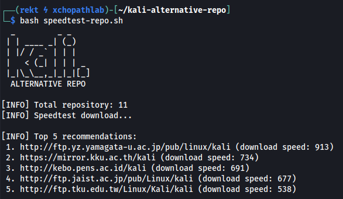

# kali-alternative-repo
Kali Linux Alternative Repositories.

----------

All alternative repositories are stored in `repositories.txt`.

Sample `/etc/apt/sources.list` template:
```
deb http://mirrors.ocf.berkeley.edu/kali kali-rolling main non-free contrib
deb-src http://mirrors.ocf.berkeley.edu/kali kali-rolling main non-free contrib
```

You can also conduct download speedtest  with `speedtest-repo.sh` script.



## Setup

```
git clone https://github.com/xchopath/kali-alternative-repo
cd kali-alternative-repo/
```

Have a great day!